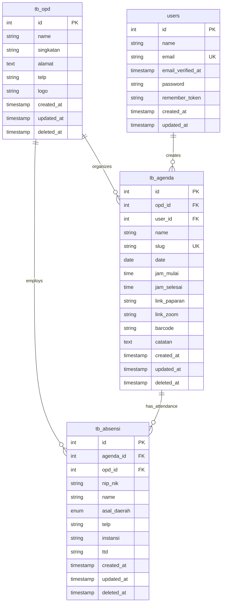

# Database Design Document - Agenda & Absensi QR Code

## 1. Entity Relationship Diagram



## 2. Table Definitions

### 2.1 tb_opd - Organization Unit Management

**Purpose**: Store information about Organizational Units (OPD) that organize events

| Column | Data Type | Constraints | Description |
|--------|-----------|-------------|-------------|
| id | BIGINT | PRIMARY KEY, AUTO_INCREMENT | Unique identifier |
| name | VARCHAR(255) | NOT NULL | Full name of OPD |
| singkatan | VARCHAR(50) | NOT NULL | Abbreviation of OPD name |
| alamat | TEXT | NOT NULL | Complete address of OPD |
| telp | VARCHAR(20) | NOT NULL | Contact phone number |
| logo | VARCHAR(255) | NULL | Path to logo file |
| created_at | TIMESTAMP | DEFAULT CURRENT_TIMESTAMP | Creation timestamp |
| updated_at | TIMESTAMP | DEFAULT CURRENT_TIMESTAMP ON UPDATE | Last update timestamp |
| deleted_at | TIMESTAMP | NULL | Soft delete timestamp |

**Indexes**:
```sql
CREATE INDEX idx_opd_name ON tb_opd(name);
CREATE INDEX idx_opd_deleted_at ON tb_opd(deleted_at);
```

### 2.2 tb_agenda - Event/Agenda Management

**Purpose**: Store event/agenda information with QR code generation

| Column | Data Type | Constraints | Description |
|--------|-----------|-------------|-------------|
| id | BIGINT | PRIMARY KEY, AUTO_INCREMENT | Unique identifier |
| opd_id | BIGINT | FOREIGN KEY → tb_opd.id | Reference to organizing OPD |
| user_id | BIGINT | FOREIGN KEY → users.id | User who created the agenda |
| name | VARCHAR(255) | NOT NULL | Event name |
| slug | VARCHAR(255) | NOT NULL, UNIQUE | URL-friendly identifier |
| date | DATE | NOT NULL | Event date |
| jam_mulai | TIME | NOT NULL | Start time |
| jam_selesai | TIME | NOT NULL | End time |
| link_paparan | VARCHAR(255) | NULL | Link to presentation materials |
| link_zoom | VARCHAR(255) | NULL | Zoom meeting link |
| barcode | VARCHAR(255) | NULL | Path to QR code file |
| catatan | TEXT | NULL | Additional notes |
| created_at | TIMESTAMP | DEFAULT CURRENT_TIMESTAMP | Creation timestamp |
| updated_at | TIMESTAMP | DEFAULT CURRENT_TIMESTAMP ON UPDATE | Last update timestamp |
| deleted_at | TIMESTAMP | NULL | Soft delete timestamp |

**Indexes**:
```sql
CREATE INDEX idx_agenda_opd_id ON tb_agenda(opd_id);
CREATE INDEX idx_agenda_user_id ON tb_agenda(user_id);
CREATE INDEX idx_agenda_date ON tb_agenda(date);
CREATE INDEX idx_agenda_slug ON tb_agenda(slug);
CREATE INDEX idx_agenda_deleted_at ON tb_agenda(deleted_at);
```

### 2.3 tb_absensi - Attendance Records

**Purpose**: Store attendance records with digital signatures

| Column | Data Type | Constraints | Description |
|--------|-----------|-------------|-------------|
| id | BIGINT | PRIMARY KEY, AUTO_INCREMENT | Unique identifier |
| agenda_id | BIGINT | FOREIGN KEY → tb_agenda.id | Reference to event |
| opd_id | BIGINT | FOREIGN KEY → tb_opd.id, NULLABLE | Reference to OPD (for in-city attendees) |
| nip_nik | VARCHAR(50) | NOT NULL | Employee ID or National ID |
| name | VARCHAR(255) | NOT NULL | Full name |
| asal_daerah | ENUM('dalam_kota', 'luar_kota') | NOT NULL | Origin: in-city or out-of-city |
| telp | VARCHAR(20) | NOT NULL | Phone number |
| instansi | VARCHAR(255) | NULL | Institution name (for out-of-city) |
| ttd | VARCHAR(255) | NULL | Path to digital signature file |
| created_at | TIMESTAMP | DEFAULT CURRENT_TIMESTAMP | Creation timestamp |
| updated_at | TIMESTAMP | DEFAULT CURRENT_TIMESTAMP ON UPDATE | Last update timestamp |
| deleted_at | TIMESTAMP | NULL | Soft delete timestamp |

**Indexes**:
```sql
CREATE INDEX idx_absensi_agenda_id ON tb_absensi(agenda_id);
CREATE INDEX idx_absensi_opd_id ON tb_absensi(opd_id);
CREATE INDEX idx_absensi_nip_nik ON tb_absensi(nip_nik);
CREATE INDEX idx_absensi_asal_daerah ON tb_absensi(asal_daerah);
CREATE INDEX idx_absensi_deleted_at ON tb_absensi(deleted_at);
```

## 3. Data Definition Language (DDL)

### 3.1 Create tb_opd Table
```sql
CREATE TABLE tb_opd (
    id BIGINT UNSIGNED AUTO_INCREMENT PRIMARY KEY,
    name VARCHAR(255) NOT NULL,
    singkatan VARCHAR(50) NOT NULL,
    alamat TEXT NOT NULL,
    telp VARCHAR(20) NOT NULL,
    logo VARCHAR(255) DEFAULT NULL,
    created_at TIMESTAMP DEFAULT CURRENT_TIMESTAMP,
    updated_at TIMESTAMP DEFAULT CURRENT_TIMESTAMP ON UPDATE CURRENT_TIMESTAMP,
    deleted_at TIMESTAMP NULL DEFAULT NULL,
    INDEX idx_opd_name (name),
    INDEX idx_opd_deleted_at (deleted_at)
) ENGINE=InnoDB DEFAULT CHARSET=utf8mb4 COLLATE=utf8mb4_unicode_ci;
```

### 3.2 Create tb_agenda Table
```sql
CREATE TABLE tb_agenda (
    id BIGINT UNSIGNED AUTO_INCREMENT PRIMARY KEY,
    opd_id BIGINT UNSIGNED NOT NULL,
    user_id BIGINT UNSIGNED NOT NULL,
    name VARCHAR(255) NOT NULL,
    slug VARCHAR(255) NOT NULL UNIQUE,
    date DATE NOT NULL,
    jam_mulai TIME NOT NULL,
    jam_selesai TIME NOT NULL,
    link_paparan VARCHAR(255) DEFAULT NULL,
    link_zoom VARCHAR(255) DEFAULT NULL,
    barcode VARCHAR(255) DEFAULT NULL,
    catatan TEXT DEFAULT NULL,
    created_at TIMESTAMP DEFAULT CURRENT_TIMESTAMP,
    updated_at TIMESTAMP DEFAULT CURRENT_TIMESTAMP ON UPDATE CURRENT_TIMESTAMP,
    deleted_at TIMESTAMP NULL DEFAULT NULL,
    INDEX idx_agenda_opd_id (opd_id),
    INDEX idx_agenda_user_id (user_id),
    INDEX idx_agenda_date (date),
    INDEX idx_agenda_slug (slug),
    INDEX idx_agenda_deleted_at (deleted_at),
    CONSTRAINT fk_agenda_opd FOREIGN KEY (opd_id) REFERENCES tb_opd(id) ON DELETE RESTRICT ON UPDATE CASCADE,
    CONSTRAINT fk_agenda_user FOREIGN KEY (user_id) REFERENCES users(id) ON DELETE CASCADE ON UPDATE CASCADE
) ENGINE=InnoDB DEFAULT CHARSET=utf8mb4 COLLATE=utf8mb4_unicode_ci;
```

### 3.3 Create tb_absensi Table
```sql
CREATE TABLE tb_absensi (
    id BIGINT UNSIGNED AUTO_INCREMENT PRIMARY KEY,
    agenda_id BIGINT UNSIGNED NOT NULL,
    opd_id BIGINT UNSIGNED DEFAULT NULL,
    nip_nik VARCHAR(50) NOT NULL,
    name VARCHAR(255) NOT NULL,
    asal_daerah ENUM('dalam_kota', 'luar_kota') NOT NULL,
    telp VARCHAR(20) NOT NULL,
    instansi VARCHAR(255) DEFAULT NULL,
    ttd VARCHAR(255) DEFAULT NULL,
    created_at TIMESTAMP DEFAULT CURRENT_TIMESTAMP,
    updated_at TIMESTAMP DEFAULT CURRENT_TIMESTAMP ON UPDATE CURRENT_TIMESTAMP,
    deleted_at TIMESTAMP NULL DEFAULT NULL,
    INDEX idx_absensi_agenda_id (agenda_id),
    INDEX idx_absensi_opd_id (opd_id),
    INDEX idx_absensi_nip_nik (nip_nik),
    INDEX idx_absensi_asal_daerah (asal_daerah),
    INDEX idx_absensi_deleted_at (deleted_at),
    CONSTRAINT fk_absensi_agenda FOREIGN KEY (agenda_id) REFERENCES tb_agenda(id) ON DELETE CASCADE ON UPDATE CASCADE,
    CONSTRAINT fk_absensi_opd FOREIGN KEY (opd_id) REFERENCES tb_opd(id) ON DELETE SET NULL ON UPDATE CASCADE
) ENGINE=InnoDB DEFAULT CHARSET=utf8mb4 COLLATE=utf8mb4_unicode_ci;
```

## 4. Sample Data (Seeders)

### 4.1 OPD Sample Data
```sql
INSERT INTO tb_opd (name, singkatan, alamat, telp, logo) VALUES
('Dinas Komunikasi dan Informatika', 'Diskominfo', 'Jl. Pemuda No. 1 Kota XYZ', '(021) 1234567', 'logos/diskominfo.png'),
('Dinas Pendidikan', 'Disdik', 'Jl. Pendidikan No. 2 Kota XYZ', '(021) 2345678', 'logos/disdik.png'),
('Dinas Kesehatan', 'Dinkes', 'Jl. Kesehatan No. 3 Kota XYZ', '(021) 3456789', 'logos/dinkes.png'),
('Dinas Pekerjaan Umum', 'PU', 'Jl. PU No. 4 Kota XYZ', '(021) 4567890', 'logos/pu.png'),
('Badan Kepegawaian Daerah', 'BKD', 'Jl. Kepegawaian No. 5 Kota XYZ', '(021) 5678901', 'logos/bkd.png');
```

### 4.2 Sample Agenda Data
```sql
INSERT INTO tb_agenda (opd_id, user_id, name, slug, date, jam_mulai, jam_selesai, link_paparan, link_zoom, catatan) VALUES
(1, 1, 'Rapat Koordinasi Digitalisasi Pelayanan Publik', 'rapat-koordinasi-digitalisasi-2024', '2024-01-15', '09:00:00', '12:00:00', 'https://example.com/presentations/1', 'https://zoom.us/j/123456789', 'Rapat penting, hadir tepat waktu'),
(2, 1, 'Sosialisasi Kurikulum Merdeka', 'sosialisasi-kurikulum-merdeka-2024', '2024-01-20', '13:00:00', '16:00:00', 'https://example.com/presentations/2', 'https://zoom.us/j/987654321', 'Diharapkan hadir seluruh Kepala Sekolah');
```

### 4.3 Sample Attendance Data
```sql
INSERT INTO tb_absensi (agenda_id, opd_id, nip_nik, name, asal_daerah, telp, instansi) VALUES
(1, 1, '197803172009011005', 'Budi Santoso, S.Kom', 'dalam_kota', '081234567890', NULL),
(1, 2, '198005222010011002', 'Siti Nurhaliza, S.Pd', 'dalam_kota', '081234567891', NULL),
(1, NULL, '3201234567890001', 'Ahmad Rahman', 'luar_kota', '081234567892', 'Dinas Pendidikan Kab. Tetangga'),
(2, 3, '197905182011012003', 'Dr. Ratih Kusuma', 'dalam_kota', '081234567893', NULL);
```

## 5. Database Constraints & Business Rules

### 5.1 Referential Integrity
- **tb_agenda.opd_id** → **tb_opd.id**: CASCADE on update, RESTRICT on delete
- **tb_agenda.user_id** → **users.id**: CASCADE on both update and delete
- **tb_absensi.agenda_id** → **tb_agenda.id**: CASCADE on both update and delete
- **tb_absensi.opd_id** → **tb_opd.id**: SET NULL on delete, CASCADE on update

### 5.2 Business Rules
1. **Unique Slug**: Each agenda must have a unique slug for QR code generation
2. **Time Validation**: jam_selesai must be after jam_mulai
3. **Date Validation**: Agenda date cannot be in the past when creating new agenda
4. **Attendance Validation**: 
   - If asal_daerah = 'dalam_kota', opd_id is required
   - If asal_daerah = 'luar_kota', instansi is required
5. **Soft Delete**: All tables use soft delete to maintain data integrity

## 6. Performance Optimization

### 6.1 Index Strategy
- Primary keys automatically indexed
- Foreign keys indexed for join performance
- Date fields indexed for date range queries
- Slug field indexed for quick lookup
- Soft delete columns indexed to exclude deleted records

### 6.2 Query Optimization
- Use eager loading for relationships
- Implement pagination for large datasets
- Cache frequently accessed data
- Use database views for complex statistics

## 7. Backup & Recovery

### 7.1 Backup Strategy
- Daily full database backup
- Hourly incremental backup for attendance data
- Weekly backup verification
- Off-site backup storage

### 7.2 Recovery Procedures
- Point-in-time recovery capability
- Test recovery procedures monthly
- Document recovery time objectives (RTO)
- Maintain backup logs and audit trails

## 8. Security Considerations

### 8.1 Data Protection
- Encrypt sensitive personal data (NIP/NIK)
- Secure file storage for signatures and logos
- Implement access control and audit logging
- Regular security audits and penetration testing

### 8.2 Compliance
- GDPR compliance for personal data handling
- Local data protection regulations
- Audit trail for data modifications
- Data retention policies

This database design provides a robust foundation for the Agenda & Absensi QR Code application with proper normalization, indexing, and security measures.